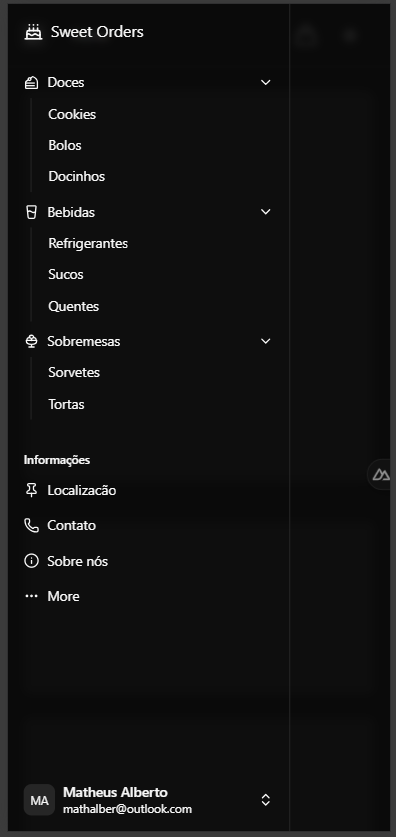
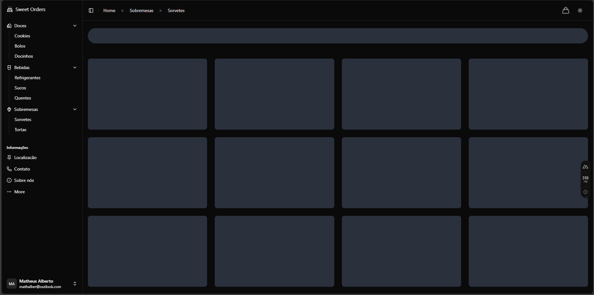
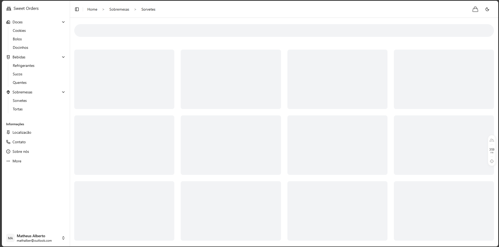
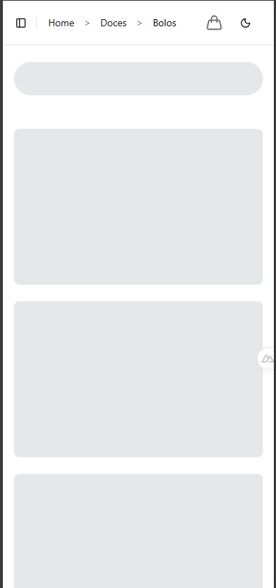

# Sweet Orders 🍰

Projeto completo de vitrine digital para doceria, desenvolvido com foco em experiência do usuário, responsividade e design moderno.

---

## Sobre o projeto

Sweet Orders é uma aplicação web para apresentação de produtos de uma doceria, com navegação intuitiva, tema escuro/claro, breadcrumbs dinâmicos, menu mobile, skeleton loading e organização por categorias (doces, bebidas, sobremesas, informações).

---

## Tecnologias utilizadas

- **Nuxt.js 3** (Vue 3)
- **TailwindCSS**
- **@nuxtjs/color-mode** (tema escuro/claro)
- **Lucide Vue** (ícones)
- **File-based Routing**
- **Composables Vue** (breadcrumbs dinâmicos)
- **Skeleton Loading**
- **Componentização total**

---

## Prints das telas

**Home**


**Menu mobile**



**Tema escuro/claro**




**Página de mobile**



**Breadcrumbs**


**Skeleton loading**

## 

## Instalação e uso

Instale as dependências:

```bash
npm install
```

Inicie o servidor de desenvolvimento:

```bash
npm run dev
```

Build para produção:

```bash
npm run build
```

Preview do build local:

```bash
npm run preview
```

---

## Estrutura de pastas

```
components/
  AppSidebar.vue
  ThemeToggle.vue
  ...
pages/
  index.vue
  Doces/
  Bebidas/
  Sobremesas/
  Informacoes/
layouts/
  default.vue
assets/
  css/
public/
  ...
```

---

## Deploy

Veja a [documentação de deploy do Nuxt](https://nuxt.com/docs/getting-started/deployment) para publicar em produção.

---

## Autor

Matheus Alberto Rodrigues da Silva
